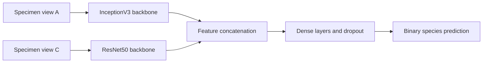

# Computer Vision for Microfossil Classification

Applied deep learning research on the feasibility of classifying microfossil species from electron microscopy images.

**Research period:** September 2022 – June 2023  
**Domain:** Computer vision, deep learning, and paleontology  
**Core technologies:** Python, TensorFlow/Keras, CNNs, transfer learning, InceptionV3, and ResNet50

<p align="center">
  
  
  
</p>

## Project at a glance

This project explored whether convolutional neural networks could support the automated identification of microfossil species from electron microscopy images. The work was conducted in collaboration with a paleontology research institute and focused on both model development and the practical conditions required for reliable classification.

The research included:

- preparing and filtering a domain-specific microscopy dataset;
- building image preprocessing and augmentation workflows;
- applying transfer learning with pretrained CNN backbones;
- comparing single-view and multi-view classification approaches;
- experimenting with feature extraction, fine-tuning, and feature fusion;
- assessing how dataset size, specimen preservation, image quality, and computational requirements affect technical feasibility.

The repository preserves three stages of experimentation, progressing from a single-image classifier to a multi-input neural network that combines visual information from different views of the same specimen.

## Technical foundation for product management

This research contributed to the technical foundation I bring to product management. Working directly with scientific data, neural network architectures, training workflows, and model evaluation developed a deeper understanding of how machine-learning systems behave beyond their user-facing functionality.

That background strengthens my ability to work on technically complex products, engage with engineering and research teams at the level of underlying system constraints, and evaluate AI-based opportunities with a grounded understanding of the relationship between data, architecture, experimentation, and product outcomes.

## Research context

Species identification in paleontology is a specialized task that depends on expert interpretation of specimen morphology. Electron microscopy provides detailed visual information, but the available datasets can be small, heterogeneous, and sensitive to specimen quality and imaging conditions.

The central question of the project was not simply whether a neural network could be trained, but whether the available data and imaging process were sufficient to support a useful automated classification workflow.

The research therefore considered several connected questions:

1. How many labeled images are required to train a meaningful classifier?
2. How does specimen preservation and image quality affect prediction quality?
3. Is a single image sufficient, or is information from multiple specimen views required?
4. Can transfer learning compensate for the limited size of a scientific image dataset?
5. What computational resources would be required for further experimentation and practical use?

## Dataset and domain-specific preparation

The `Materials` directory contains electron microscopy image archives for four *Aldanella* taxa:

- *Aldanella attleborensis*;
- *Aldanella crassa* Missarzhevsky;
- *Aldanella operosa* Missarzhevsky;
- *Aldanella sibirica* sp. nov.

The public notebooks focus on binary classification between *Aldanella attleborensis* and *Aldanella sibirica*.

Preparing the data required more than resizing images and assigning labels. The notebooks include logic for:

- selecting specific specimen views from the source TIFF files;
- excluding images captured from inconsistent angles;
- detecting specimens with a missing paired view;
- keeping the two image streams aligned for multi-input experiments;
- organizing images into class-specific training and validation directories;
- rescaling pixel values and converting images to `150 × 150` RGB tensors;
- applying rotational augmentation to the training data.

This preprocessing reflects an important characteristic of applied scientific machine learning: dataset construction and domain-specific quality control are part of the modeling problem itself.

## Experimental progression

| Experiment | Research focus | Technical approach |
|---|---|---|
| [Experiment 1](https://github.com/Fedor4096/Microfossils-classification/blob/main/Experiment_1.ipynb) | Establish a single-view baseline | ImageNet-pretrained InceptionV3 for feature extraction, followed by a dense binary classifier and an additional transfer-learning stage with image augmentation |
| [Experiment 2](https://github.com/Fedor4096/Microfossils-classification/blob/main/Experiment_2.ipynb) | Test whether two specimen views provide complementary information | Separate InceptionV3 and ResNet50 branches, pretrained feature extraction, branch-specific dense layers, and feature concatenation |
| [Experiment 3](https://github.com/Fedor4096/Microfossils-classification/blob/main/Experiment_3.ipynb) | Train a unified multi-input architecture | Two pretrained CNN backbones connected to a shared classification head through feature-level fusion |

### Experiment 1 — single-view transfer learning

The first experiment established a binary classification workflow using one image per specimen. An ImageNet-pretrained InceptionV3 model was used as a convolutional feature extractor, while a custom dense network performed the final classification.

The experiment also explored an extended training workflow with rotational augmentation, stochastic gradient descent, learning-rate reduction, dropout, and early stopping.

### Experiment 2 — combining two specimen views

The second experiment introduced two aligned image inputs representing different views of the same specimen. The inputs were processed through separate pretrained backbones:

- InceptionV3 for the first view;
- ResNet50 for the second view.

The resulting representations were passed through branch-specific dense layers and combined into a shared representation for classification. This experiment tested whether complementary visual information could compensate for ambiguity in a single projection.

### Experiment 3 — unified multi-input neural network

The third experiment consolidated the multi-view approach into a single TensorFlow/Keras model. Both CNN branches and the shared classification head were represented within one computational graph, allowing the combined architecture to be trained and evaluated as a unified system.

## Model architecture



The experimental architecture combines:

- pretrained convolutional representations from ImageNet;
- global average pooling for compact feature vectors;
- feature-level fusion across two image streams;
- fully connected layers with ReLU activation;
- dropout regularization;
- sigmoid output for binary classification;
- SGD with momentum and early stopping during multi-input training.

The purpose of the multi-branch design was to investigate whether different views contain complementary morphological signals that are difficult to capture from a single image.

## Evaluation and research findings

The experiments were conducted on a small and imbalanced research dataset. The later multi-view experiments used 59 training and 18 validation image pairs across two classes.

| Experiment | Validation set | Recorded validation accuracy |
|---|---:|---:|
| Single-view InceptionV3 | 22 images | 72.7% |
| Multi-view feature fusion | 18 image pairs | 72.2% |
| Unified multi-input model | 18 image pairs | 72.2% |

The recorded results should be interpreted as part of a feasibility study rather than as a production benchmark. In the later experiments, 13 of the 18 validation examples belonged to the larger class, producing a 72.2% majority-class baseline. The multi-view models did not demonstrate a reliable improvement over that baseline on the available validation data.

This was itself a meaningful research result. The experiments showed that model complexity alone could not compensate for limited and imbalanced training data. They also helped identify the importance of dataset scale, consistent imaging, specimen-level data quality, paired-view availability, and more robust evaluation design for future work.

## Technical scope

### Machine learning

- binary image classification;
- convolutional neural networks;
- transfer learning;
- pretrained feature extraction;
- multi-input neural networks;
- feature-level fusion;
- regularization and early stopping.

### Data and experimentation

- domain-specific image selection;
- paired-view alignment;
- missing-view filtering;
- image rescaling and augmentation;
- train/validation dataset construction;
- iterative architecture development;
- baseline-aware result interpretation.

### Technology stack

- Python;
- TensorFlow and Keras;
- InceptionV3;
- ResNet50;
- NumPy;
- pandas;
- Matplotlib;
- Jupyter Notebook.

## Repository structure

```text
Microfossils-classification/
├── Experiment_1.ipynb   # Single-view InceptionV3 workflow
├── Experiment_2.ipynb   # Separate two-view feature extraction and fusion
├── Experiment_3.ipynb   # Unified multi-input InceptionV3 + ResNet50 model
├── Materials/           # Source electron microscopy image archives
├── LICENSE              # Apache License 2.0 for repository code
└── README.md
```

The notebooks preserve the original research workflow and local directory conventions used during experimentation. Reproducing the experiments may require adapting data paths and dependency versions to a current environment.

## Licensing and attribution

### Source code and notebooks

The source code and notebooks in this repository are licensed under the [Apache License 2.0](LICENSE).

### Electron microscopy images and research data

The electron microscopy images, research datasets in the `Materials` directory, and specimen images displayed in this README are **not licensed under the Apache License 2.0**. Copyright and related rights remain with their respective rights holders.

These materials are included to document the research project. Do not reproduce, redistribute, publish, incorporate into another dataset, or use them to train machine-learning models without prior permission from the relevant rights holder. Any authorized use must include appropriate attribution to the dataset creators, the collaborating research institution, and Fedor Lozovoy, as applicable.

To request permission or clarify attribution requirements, please contact the repository owner through GitHub.

